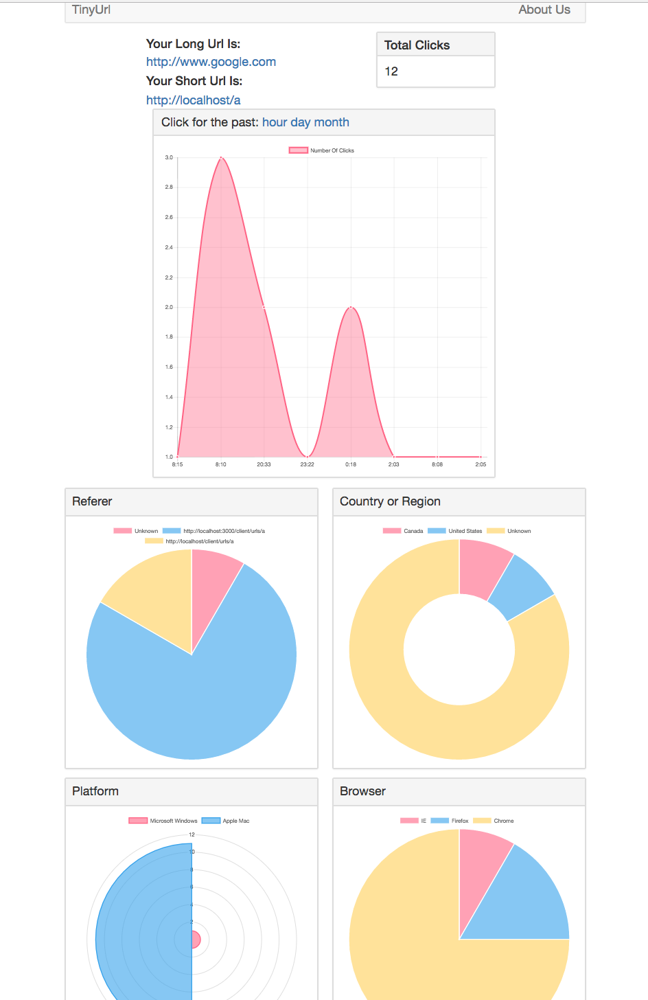

#Tiny URL Service (google shortener)
----
Author: __tmcwei__(tmcwei@hotmail.com)

## Description
This Service will run 1 nginx container as a reverse proxy server and load balancer. It will also run a redix container in front of 3 running node js containers to improve the server performance.

Developed a Rest API web server using Node.js and Express. 
Designed and implemented a Single Page Web UI using AngularJS2 and Bootstrap.
Persisted application data using MongoDB and applied Redis as cache database to improve the server performance.
To handle 10k+ QPS, employed Nginx HTTP server, and use it as a reverse proxy server and load balancer. 
Dockerized the server and scale up the server into multiple instances.

## Usage
``docker-compose up --build``